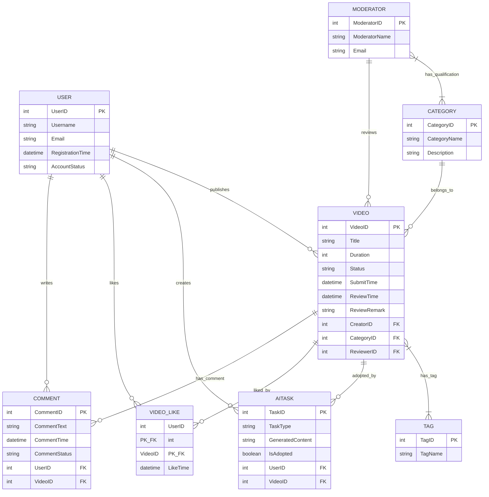

```mermaid
erDiagram
    USER ||--o{ VIDEO : "publishes"
    CATEGORY ||--o{ VIDEO : "belongs_to"
    VIDEO }|--|{ TAG : "has_tag"
    MODERATOR }|--|{ CATEGORY : "has_qualification"
    USER ||--o{ AITASK : "creates"
    VIDEO ||--o{ AITASK : "adopted_by"
    USER ||--o{ VIDEO_LIKE : "likes"
    VIDEO ||--o{ VIDEO_LIKE : "liked_by"
    USER ||--o{ COMMENT : "writes"
    VIDEO ||--o{ COMMENT : "has_comment"
    MODERATOR ||--o{ VIDEO : "reviews"

    USER {
        int UserID PK
        string Username
        string Email
        datetime RegistrationTime
        string AccountStatus
    }
    VIDEO {
        int VideoID PK
        string Title
        int Duration
        string Status
        datetime SubmitTime
        datetime ReviewTime
        string ReviewRemark
        int CreatorID FK
        int CategoryID FK
        int ReviewerID FK
    }
    CATEGORY {
        int CategoryID PK
        string CategoryName
        string Description
    }
    TAG {
        int TagID PK
        string TagName
    }
    MODERATOR {
        int ModeratorID PK
        string ModeratorName
        string Email
    }
    AITASK {
        int TaskID PK
        string TaskType
        string GeneratedContent
        boolean IsAdopted
        int UserID FK
        int VideoID FK
    }
    VIDEO_LIKE {
        int UserID PK_FK
        int VideoID PK_FK
        datetime LikeTime
    }
    COMMENT {
        int CommentID PK
        string CommentText
        datetime CommentTime
        string CommentStatus
        int UserID FK
        int VideoID FK
    }
```