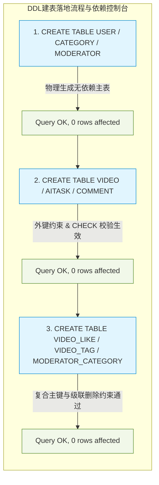

```mermaid
graph LR
    subgraph DDL建表落地流程与依赖控制台
    A[1. CREATE TABLE USER / CATEGORY / MODERATOR] -->|物理生成无依赖主表| B[Query OK, 0 rows affected]
    B --> C[2. CREATE TABLE VIDEO / AITASK / COMMENT]
    C -->|外键约束 & CHECK 校验生效| D[Query OK, 0 rows affected]
    D --> E[3. CREATE TABLE VIDEO_LIKE / VIDEO_TAG / MODERATOR_CATEGORY]
    E -->|复合主键与级联删除约束通过| F[Query OK, 0 rows affected]
    end

    style A fill:#e1f5fe,stroke:#0288d1
    style C fill:#e1f5fe,stroke:#0288d1
    style E fill:#e1f5fe,stroke:#0288d1
    style B fill:#f1f8e9,stroke:#558b2f
    style D fill:#f1f8e9,stroke:#558b2f
    style F fill:#f1f8e9,stroke:#558b2f
```