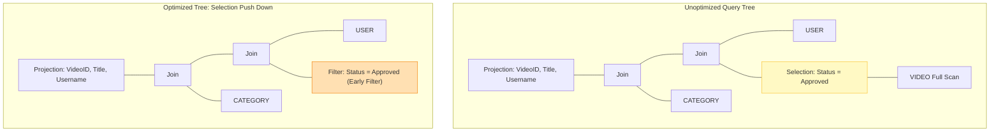

```mermaid
graph TD
    subgraph Tree1 [Unoptimized Query Tree]
        T1["Projection: VideoID, Title, Username"] --- J1["Join"]
        J1 --- J2["Join"]
        J1 --- C1["CATEGORY"]
        J2 --- U1["USER"]
        J2 --- S1["Selection: Status = Approved"]
        S1 --- V1["VIDEO Full Scan"]
    end

    subgraph Tree2 [Optimized Tree: Selection Push Down]
        T2["Projection: VideoID, Title, Username"] --- J3["Join"]
        J3 --- J4["Join"]
        J3 --- C2["CATEGORY"]
        J4 --- U2["USER"]
        J4 --- Filter["Filter: Status = Approved (Early Filter)"]
    end

    style Filter fill:#ffe0b2,stroke:#f57c00
    style S1 fill:#fff9c4,stroke:#fbc02d
```